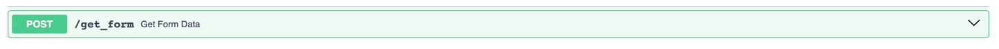
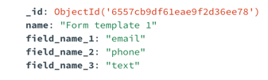
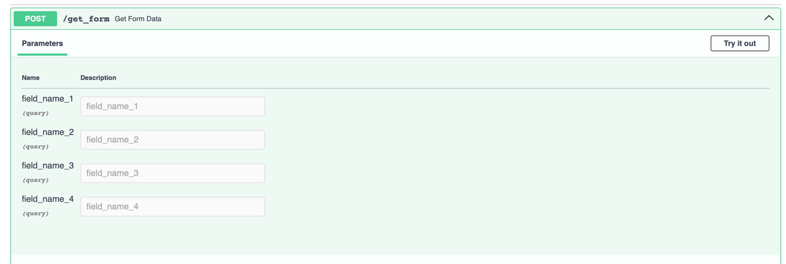

# Web-приложение для определения заполненных форм.

### FastAPI + Mongodb + Docker

приложение получается на вход заполненную форму с одним или несколькими полями, а
возвращает название одной из форм, которую можно заполнить полученной информацией.

# Запуск:

```code
docker-compose build

docker-compose up -d 
```

> сервер разворачивается на http://0.0.0.0:8000 <br>
> Swagger http://0.0.0.0:8000/docs

Приложение получается на вход заполненную форму с одним или несколькими полями, а
возвращает название одной из форм, которую можно заполнить полученной информацией.

# FastAPI

## <span style="color:lightblue;">[POST]</span>


Параметры передаются запросом такого вида:

```code
field_name1=value1&field_name2=value2
```

Всего должно поддерживаться четыре типа данных полей:

* email
* телефон
* дата
* текст <br>

Все типы кроме текста поддерживают валидацию:<br>
Телефон передается в стандартном формате **_+7 xxx xxx xx xx_**
(разделителями могут быть пробелы,тире или пустота)<br>
Дата передается в формате _**DD.MM.YYYY**_ или **_YYYY-MM-DD_**.

В ответ приходит имя шаблона формы, если она была найдена.
В качестве подходящего шаблона выбирается тот, поля которого совпали с полями в присланной форме.
Совпадающими считаются поля, у которых совпали имя и тип значения.<br>

Полей в пришедшей форме может быть больше чем в шаблоне, в этом случае шаблон все равно будет считаться подходящим.
Самое главное, **что все поля шаблона присутствовали в форме**.

Если подходящей формы не нашлось, вернуть ответ в следующем формате

```json
{
  field_name1: FIELD_TYPE,
  feild_name2: FIELD_TYPE
}
```

# MongoDB

В базе хранятся шаблоны с именами и необходимыми полями для заполнения этого шаблона.<br>
<br>


# Тесты

1. Для заполнения базы тестовыми данными выполнить после запуска docker-compose:

```code
docker exec -it server_fastapi python3 database.py
```

2. Для тестирования реализован скрипт с некоторыми тестовыми кейсами, которые включает работу с корректными и
   некорректными данными

```code
docker exec -it server_fastapi pytest test_script.py
```
3. Для ручного тестирования необходимо использовать Swagger

> http://0.0.0.0:8000/docs
 



